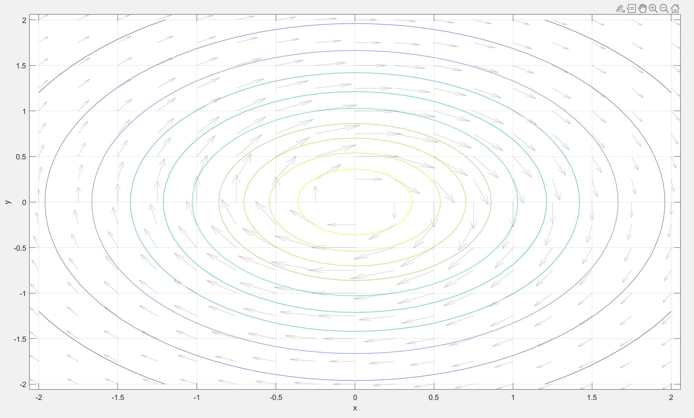

# ELEN30011 EDM Task

- Xiufu SUN 1372750
- Wenyang SUN 1354302

## 1.1

For rectangular coordinates and cylindrical coodinates,

$$
x = rcos\phi
$$

$$
y = rsin\phi
$$

$$
z = z
$$

(a)

$x = 1\times cos(0) = 1$, $y = 1\times sin(0) = 0$, $z = 0$

$$(1, 0, 0)$$

(b)

$x = 1\times cos(\pi) = -1$, $y = 1\times sin(\pi) = 0$, $z = 0$

$$(-1, 0, 0)$$

(c)

$x = 1\times cos(-\pi / 2) = 0$, $y = 1\times sin(-\pi / 2) = -1$, $z = 3$

$$(0, -1, 3)$$

(d)

$x = 0\times cos(-\pi) = 0$, $y = 0\times sin(-\pi) = 0$, $z = -2$

$$(0, 0, -2)$$

(e)

$x = -1\times cos(0) = -1$, $y = -1\times sin(0) = 0$, $z = 0$

$$(-1, 0, 0)$$

## 1.2

For spherical coordinates and rectangular coordinates,

$$
x = rcos\phi sin\theta
$$

$$
y = rsin\phi sin\theta
$$

$$
z = rcos\theta
$$

It can be noted that, $r$ is the modulus of a vector $r = \sqrt{x^2+y^2+z^2}$;
$\phi$ is the angle with the x-axis in x-y plane $\phi = arctan(y/x)$;
$\theta$ is the angle with the z-axis $\theta = arctan(\sqrt{x^2 + y^2}/z)$.
In order to make the answer unique, we assume $r \geq 0, \phi \in [0, 2\pi), \theta \in [0, \pi]$

(a)

$r = \sqrt{1^2+0^2+0^2} = 1$,
$\phi = arctan(0/1) = 0$,
$\theta = arctan(\sqrt{1^2 + 0^2}/0) = \pi/2$

$$(1, 0, \pi/2)$$

(b)

$r = \sqrt{0^2+1^2+0^2} = 1$,
$\phi = arctan(1/0) = \pi/2$,
$\theta = arctan(\sqrt{0^2 + 1^2}/0) = \pi/2$

$$(1, \pi/2, \pi/2)$$

(c)

$r = \sqrt{0^2+0^2+1^2} = 1$,
$\phi = arctan(0/0) = undefined$,
$\theta = arctan(\sqrt{0^2 + 0^2}/1) = 0$

$$(1, 0, 0)$$

- $\phi$ can be any real number here.

(d)

$r = \sqrt{0^2+1^2+1^2} = \sqrt2$,
$\phi = arctan(1/0) = \pi/2$,
$\theta = arctan(\sqrt{0^2 + 1^2}/1) = \pi/4$

$$(\sqrt2, \pi/2, \pi/4)$$

(e)

$r = \sqrt{0^2+0^2+0^2} = 0$,
$\phi = arctan(0/0) = undefined$,
$\theta = arctan(\sqrt{0^2 + 0^2}/0) = undefined$

$$(0, 0, 0)$$

- $r = 0$, $\phi$ and $\theta$ can be any real number here.

## 2.1

(a) Let $$x=rcos\phi, y=rsin\phi, z=z$$
Jacobin Matrix:

$$
J(r, \phi, z) =
\begin{pmatrix}
    cos\phi & -rsin\phi & 0 \\
    sin\phi & rcos\phi & 0 \\
    0 & 0 & 1
\end{pmatrix}
$$

$$
\begin{pmatrix}
    d{x} \\
    d{y} \\
    d{z}
\end{pmatrix} = J
\begin{pmatrix}
    d{r} \\
    d{\phi} \\
    d{z}
\end{pmatrix}
$$

Hence find expressions for $\hat{r}$ and $\hat{\phi}$ in terms of $\hat{x}$ and $\hat{y}$.
Since $\hat{r}$ and $\hat{\phi}$ are unit vectors, let $r = 1$

$$
T(\phi) =
\begin{pmatrix}
    cos\phi & -sin\phi & 0 \\
    sin\phi & cos\phi & 0 \\
    0 & 0 & 1
\end{pmatrix}
$$

---

Or, considering

$$
\hat{r} = cos\phi \hat{x} + sin\phi \hat{y} \\
\hat{\phi} = -sin\phi \hat{x} + cos\phi \hat{y} \\
v = v_r\hat{r} + v_{\phi}\hat{\phi} + v_z\hat{z}
$$

$$
v_x = v·\hat{x} = v_r cos\phi - v_{\phi} sin\phi \\
v_y = v·\hat{y} = v_r sin\phi + v_{\phi} cos\phi \\
v_z = v·\hat{z} = v_z
$$

In order to make

$$
\begin{pmatrix}
    v_x \\
    v_y \\
    v_z
\end{pmatrix} = T(\phi)
\begin{pmatrix}
    v_r \\
    v_{\phi} \\
    v_z
\end{pmatrix}
$$

$$
T(\phi) =
\begin{pmatrix}
    cos\phi & -sin\phi & 0 \\
    sin\phi & cos\phi & 0 \\
    0 & 0 & 1
\end{pmatrix}
$$

(b)
We've got that

$$
T(\phi) =
\begin{pmatrix}
    cos\phi & -sin\phi & 0 \\
    sin\phi & cos\phi & 0 \\
    0 & 0 & 1
\end{pmatrix}
$$

The (i, j)-cofactor is $C_{i,j} = (-1)^{i+j}M_{i,j}$, where $M_{i,j}$ is the (i, j)-minor.

$$
C_{11} = (-1)^{1+1}M_{11} =
\begin{vmatrix}
    cos\phi & 0 \\
    0 & 1
\end{vmatrix}
= cos\phi
$$

Similarly,

$$
\begin{matrix}
    & C_{12} = -sin\phi & C_{13} = 0 \\
    C_{21} = sin\phi & C_{22} = cos\phi & C_{23} = 0 \\
    C_{31} = 0 & C_{32} = 0 & C_{33} = 1
\end{matrix}
$$

Hence,

$$
(T^*(\phi))^T =
\begin{pmatrix}
    cos\phi & -sin\phi & 0 \\
    sin\phi & cos\phi & 0 \\
    0 & 0 & 1
\end{pmatrix}
$$

The adjugate matrix of T is:

$$
T^*(\phi) =
\begin{pmatrix}
    cos\phi & sin\phi & 0 \\
    -sin\phi & cos\phi & 0 \\
    0 & 0 & 1
\end{pmatrix}
$$

$$
det[T(\phi)] = 1
$$

Based on Cramer's rule,

$$
T^{-1}(\phi) = \frac{1}{det}T^*(\phi)
$$

Hence,

$$
T^{-1}(\phi) =
\begin{pmatrix}
    cos\phi & sin\phi & 0 \\
    -sin\phi & cos\phi & 0 \\
    0 & 0 & 1
\end{pmatrix}
$$

(c)

$$
r = \sqrt{x^2 + y^2} \\
cos(\phi) = \frac{x}{\sqrt{x^2 + y^2}} \\
sin(\phi) = \frac{y}{\sqrt{x^2 + y^2}}
$$

(d)

According to the result of part c, substitute $cos\phi$ and $sin\phi$:

$$
T^{-1}(\phi) =
\begin{pmatrix}
    cos\phi & sin\phi & 0 \\
    -sin\phi & cos\phi & 0 \\
    0 & 0 & 1
\end{pmatrix} \\\\
S(P) =
\begin{pmatrix}
    \frac{x}{\sqrt{x^2 + y^2}} & \frac{y}{\sqrt{x^2 + y^2}} & 0 \\
    -\frac{y}{\sqrt{x^2 + y^2}} & \frac{x}{\sqrt{x^2 + y^2}} & 0 \\
    0 & 0 & 1
\end{pmatrix}
$$

## 2.2

In Question 2.1(d), we've got

$$
S(P) =
\begin{pmatrix}
    \frac{x}{\sqrt{x^2 + y^2}} & \frac{y}{\sqrt{x^2 + y^2}} & 0 \\
    -\frac{y}{\sqrt{x^2 + y^2}} & \frac{x}{\sqrt{x^2 + y^2}} & 0 \\
    0 & 0 & 1
\end{pmatrix}
$$

In this task, we assume $v_x=−1, v_y=0, v_z=0$.

(a) $(0, -1, 0)^T$

When P = (0, -1, 0)

$$
\begin{pmatrix}
    v_r \\
    v_\phi \\
    v_z
\end{pmatrix} =
S(P)
\begin{pmatrix}
    v_x \\
    v_y \\
    v_z
\end{pmatrix} =
\begin{pmatrix}
    0 & -1 & 0 \\
    1 & 0 & 0 \\
    0 & 0 & 1
\end{pmatrix}
\begin{pmatrix}
    -1 \\
    0 \\
    0
\end{pmatrix} =
\begin{pmatrix}
    0 \\
    -1 \\
    0
\end{pmatrix}
$$

(b) $(-1, 0, 0)^T$

When P = (1, 0, 0)

$$
\begin{pmatrix}
    v_r \\
    v_\phi \\
    v_z
\end{pmatrix} =
S(P)
\begin{pmatrix}
    v_x \\
    v_y \\
    v_z
\end{pmatrix} =
\begin{pmatrix}
    1 & 0 & 0 \\
    0 & 1 & 0 \\
    0 & 0 & 1
\end{pmatrix}
\begin{pmatrix}
    -1 \\
    0 \\
    0
\end{pmatrix} =
\begin{pmatrix}
    -1 \\
    0 \\
    0
\end{pmatrix}
$$

(c) $(1, 0, 0)^T$

When P = (-1, 0, 0)

$$
\begin{pmatrix}
    v_r \\
    v_\phi \\
    v_z
\end{pmatrix} =
S(P)
\begin{pmatrix}
    v_x \\
    v_y \\
    v_z
\end{pmatrix} =
\begin{pmatrix}
    -1 & 0 & 0 \\
    0 & -1 & 0 \\
    0 & 0 & 1
\end{pmatrix}
\begin{pmatrix}
    -1 \\
    0 \\
    0
\end{pmatrix} =
\begin{pmatrix}
    1 \\
    0 \\
    0
\end{pmatrix}
$$

(d) $(-\frac{\sqrt2}{2}, -\frac{\sqrt2}{2}, 0)^T$

When P = (1, -1, 0)

$$
\begin{pmatrix}
    v_r \\
    v_\phi \\
    v_z
\end{pmatrix} =
S(P)
\begin{pmatrix}
    v_x \\
    v_y \\
    v_z
\end{pmatrix} =
\begin{pmatrix}
    \frac{\sqrt2}{2} & -\frac{\sqrt2}{2} & 0 \\
    \frac{\sqrt2}{2} & \frac{\sqrt2}{2} & 0 \\
    0 & 0 & 1
\end{pmatrix}
\begin{pmatrix}
    -1 \\
    0 \\
    0
\end{pmatrix} =
\begin{pmatrix}
    -\frac{\sqrt2}{2} \\
    -\frac{\sqrt2}{2} \\
    0
\end{pmatrix}
$$

(e) $(-\lim_{x \to 0, y \to 0}{\frac{x}{\sqrt{x^2 + y^2}}}, \lim_{x \to 0, y \to 0}{\frac{y}{\sqrt{x^2 + y^2}}}, 0)^T$

When P = (0, 0, 0)

We have to compute:

$$
\lim_{x \to 0, y \to 0}{\frac{x}{\sqrt{x^2 + y^2}}} \\
\lim_{x \to 0, y \to 0}{\frac{y}{\sqrt{x^2 + y^2}}}
$$

However, we do not know the path of (x, y) approaching to 0.

We get $S(P)$ and the result:

$$
\begin{align*}
\begin{pmatrix}
    v_r \\
    v_\phi \\
    v_z
\end{pmatrix} =
S(P)
\begin{pmatrix}
    v_x \\
    v_y \\
    v_z
\end{pmatrix} &=
\begin{pmatrix}
    \lim_{x \to 0, y \to 0}{\frac{x}{\sqrt{x^2 + y^2}}} & \lim_{x \to 0, y \to 0}{\frac{y}{\sqrt{x^2 + y^2}}} & 0 \\
    -\lim_{x \to 0, y \to 0}{\frac{y}{\sqrt{x^2 + y^2}}} & \lim_{x \to 0, y \to 0}{\frac{x}{\sqrt{x^2 + y^2}}} & 0 \\
    0 & 0 & 1
\end{pmatrix}
\begin{pmatrix}
    -1 \\
    0 \\
    0
\end{pmatrix} \\
&=
\begin{pmatrix}
    -\lim_{x \to 0, y \to 0}{\frac{x}{\sqrt{x^2 + y^2}}} \\
    \lim_{x \to 0, y \to 0}{\frac{y}{\sqrt{x^2 + y^2}}} \\
    0
\end{pmatrix}
\end{align*}
$$

$r$ and $\phi$ are undefined, $z = 0$.

## 3.1

(a)

```Matlab
x = -2:.1:2;
y = -2:.1:2;
[xx, yy] = meshgrid(x, y);

size(xx)
size(yy)
```

Which output is:

```Matlab
ans =

    41    41

ans =

    41    41
```

$xx$ and $yy$ are both $41 \times 41$ matrix.

(b)

```Matlab
x = -2:.1:2;
y = -2:.1:2;
[xx, yy] = meshgrid(x, y);

size(xx)
size(yy)

zz = 1./sqrt(1 + xx.^2 + yy.^2);
figure(1);
surfl(xx, yy, zz);
xlabel('x');
ylabel('y');
zlabel('V(x,y)');
grid on;
```


Based on the picture above, it has been shown that the surface exhibit a maximum.

After checked the value "zz" in workspace, we get the maximum point is $(0, 0, 1)$.

For certain plane, origin can always be the point with the highest electrostatic potential. If a charge moves in any direction on its x-y plane, the electric field does positive work on it.

(c)
A circle.

$$
V=\frac{1}{\sqrt{1+x^2+y^2}} \\
\sqrt{1+x^2+y^2} = \frac{1}{V} \\
r = \sqrt{x^2 + y^2} = \sqrt{\frac{1}{V^2} - 1}
$$

Its radius is $\sqrt{\frac{1}{V^2} - 1}$

If $V = c > 1$, radius will be an imaginary number, which is impossible here. Hence, c will never be greater than 1.

(d)

```Matlab
figure(2);
contour(xx, yy,zz, 10);
xlabel('x');
ylabel('y');
grid on;
```


"10" means: Display 10 contour lines at automatically chosen levels (heights).

## 3.2

(a)

```Matlab
exx = xx./(1 + xx.^2 + yy.^2).^(3/2);
eyy = yy./(1 + xx.^2 + yy.^2).^(3/2);

figure(3);
quiver(xx,yy,exx,eyy);
xlabel('x');
ylabel('y');
grid on;
```


(b)

```Matlab
xnew = -2:.25:2;
ynew = xnew;
[xxnew, yynew] = meshgrid(xnew, ynew);
exxnew = xxnew./(1 + xxnew.^2 + yynew.^2).^(3/2);
eyynew = yynew./(1 + xxnew.^2 + yynew.^2).^(3/2);

figure(4);
quiver(xxnew, yynew, exxnew, eyynew);
hold on;
```


- More "sparse": xx and yy are $41\times 41$ matrix (interval 0.1), while xxnew and yynew are $17\times 17$ matrix (interval 0.25).

(c)

```Matlab
figure(2);
hold on;
quiver(xxnew, yynew, exxnew, eyynew);
```


Perpendicular to each other.

## 3.3

(a)

The contour V is a curve, its tangents is $T(s)= \dot{x}(s) \hat{x} + \dot{y}(s) \hat{y}$

Based on the chain rule, which is:

$$
\frac{d}{ds} = \frac{d}{dx} \frac{dx}{ds}
$$

Since $\nabla = \frac{\partial}{\partial{x}}i + \frac{\partial}{\partial{y}}j$, the gradient of V is

$$
\nabla{V} = \frac{\partial{V}}{\partial{x}}i + \frac{\partial{V}}{\partial{y}}j
$$

$$
\nabla{V} \cdot T(s) = \nabla{V} \cdot \frac{d}{ds}(x(s), y(s)) = \frac{d}{ds}V(x(s), y(s))
$$

Since V is constant along the contour, its derivative is zero.

$$
\nabla{V} \cdot T(s) = 0
$$

In Task 3.2, we got $E(x,y) = −\nabla{V} (x,y)$

Hence, we get the fomular 11.

According to the electric field (8) and (9),

$$
E(x(s), y(s)) \approx \frac{x(s)\hat{x} + y(s)\hat{y}}{(1 + x^2(s) + y^2(s))^{\frac{3}{2}}}
$$

In formula (12),

$$
T(s) = \hat{T}(x(s), y(s)) \approx \frac{y(s)\hat{x} - x(s)\hat{y}}{\sqrt{1 + x^2(s) + y^2(s)}}
$$

$$
\overrightarrow{E} \cdot \overrightarrow{T} = \frac{x(s)y(s) - y(s)x(s)}{(1 + x^2(s) + y^2(s))^{2}} = 0
$$

The dot product of vectors is 0 means these vectors are perpendicular.

For $\forall (x(s),y(s)) \in \mathbb{R}^2, s\in \mathbb{R}$, $\overrightarrow{E} \cdot \overrightarrow{T} = 0$, which means $T(s)$ must be everywhere perpendicular to $E(x(s),y(s))$.

(b)

```Matlab
close all
clear
clc

x = -2:.1:2;
y = -2:.1:2;
[xx, yy] = meshgrid(x, y);

zz = 1./sqrt(1 + xx.^2 + yy.^2);

figure(4);
contour(xx, yy,zz, 10);
xlabel('x');
ylabel('y');
grid on;

exx = xx./(1 + xx.^2 + yy.^2).^(3/2);
eyy = yy./(1 + xx.^2 + yy.^2).^(3/2);

xnew = -2:.25:2;
ynew = xnew;
[xxnew, yynew] = meshgrid(xnew, ynew);
exxnew = yynew./(1 + xxnew.^2 + yynew.^2).^(3/2);
eyynew = -xxnew./(1 + xxnew.^2 + yynew.^2).^(3/2);

figure(4);
hold on;
quiver(xxnew, yynew, exxnew, eyynew, "Color","#C0C0C0");
hold off;
```



(c)

We've already found that the electric field $E(x,y) = −\nabla{V} (x,y)$, this figure shows:

- $\hat{T}$ is the tangent vector of V, and it is perpendicular to the electric field $E$.
- Also, the electric field $E$ is perpendicular to the contours $V$.

This means the electric field is not divergence, its curl will be 0.

$$
\nabla \times E = 0
$$

It is a special case of Maxwell's Equations, in this case $E = -grad(V)$.
