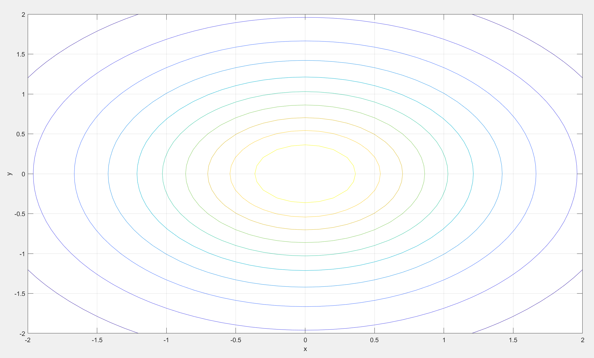

# ELEN30011 EDM Task

- Xiufu SUN 1372750

## 1.1

For rectangular coordinates and cylindrical coodinates,

$$
x = rcos\phi
$$

$$
y = rsin\phi
$$

$$
z = z
$$

(a)

$$(1, 0, 0)$$

(b)

$$(-1, 0, 0)$$

(c)

$$(0, -1, 3)$$

(d)

$$(0, 0, -2)$$

(e)

$$(-1, 0, 0)$$

## 1.2

For spherical coordinates and rectangular coordinates,

$$
x = rcos\phi sin\theta
$$

$$
y = rsin\phi sin\theta
$$

$$
z = rcos\theta
$$

It can be noted that, $r$ is the modulus of a vector $\sqrt{x^2+y^2+z^2}$, $\phi$ is the angle with the x-axis in x-y plane, $\theta$ is the angle with the z-axis.

(a)

$$(1, 0, \pi/2)$$

(b)

$$(1, \pi/2, \pi/2)$$

(c)

$$(1, 0, 0)$$

- $\phi$ can be any real number here.

(d)

$$(\sqrt2, \pi/2, \pi/4)$$

(e)

$$(0, 0, 0)$$

- $r = 0$, $\phi$ and $\theta$ can be any real number here.

## 2.1

(a) Let $$x=rcos\phi, y=rsin\phi, z=z$$
Jacobin Matrix:

$$
J(r, \phi, z) =
\begin{pmatrix}
    cos\phi & -rsin\phi & 0 \\
    sin\phi & rcos\phi & 0 \\
    0 & 0 & 1
\end{pmatrix}
$$

Hence find expressions for $\hat{r}$ and $\hat{\phi}$ in terms of $\hat{x}$ and $\hat{y}$.

$$
\begin{pmatrix}
    \hat{r} \\
    \hat{\phi} \\
    \hat{z}
\end{pmatrix} = J
\begin{pmatrix}
    \hat{x} \\
    \hat{y} \\
    \hat{z}
\end{pmatrix}
$$

Since $\hat{r}$ and $\hat{\phi}$ are unit vectors, let $r = 1$

$$
T(\phi) =
\begin{pmatrix}
    cos\phi & -sin\phi & 0 \\
    sin\phi & cos\phi & 0 \\
    0 & 0 & 1
\end{pmatrix}
$$

---

Or, considering

$$
\hat{r} = cos\phi \hat{x} + sin\phi \hat{y} \\
\hat{\phi} = -sin\phi \hat{x} + cos\phi \hat{y} \\
v = v_r\hat{r} + v_{\phi}\hat{\phi} + v_z\hat{z}
$$

$$
v_x = v·\hat{x} = v_r cos\phi - v_{\phi} sin\phi \\
v_y = v·\hat{y} = v_r sin\phi + v_{\phi} cos\phi \\
v_z = v·\hat{z} = v_z
$$

In order to make

$$
\begin{pmatrix}
    v_x \\
    v_y \\
    v_z
\end{pmatrix} = T(\phi)
\begin{pmatrix}
    v_r \\
    v_{\phi} \\
    v_z
\end{pmatrix}
$$

$$
T(\phi) =
\begin{pmatrix}
    cos\phi & -sin\phi & 0 \\
    sin\phi & cos\phi & 0 \\
    0 & 0 & 1
\end{pmatrix}
$$

(b)
We've got that

$$
T(\phi) =
\begin{pmatrix}
    cos\phi & -sin\phi & 0 \\
    sin\phi & cos\phi & 0 \\
    0 & 0 & 1
\end{pmatrix}
$$

Hence,

$$
(T^*(\phi))^T =
\begin{pmatrix}
    cos\phi & -sin\phi & 0 \\
    sin\phi & cos\phi & 0 \\
    0 & 0 & 1
\end{pmatrix}
$$

$$
T^*(\phi) =
\begin{pmatrix}
    cos\phi & sin\phi & 0 \\
    -sin\phi & cos\phi & 0 \\
    0 & 0 & 1
\end{pmatrix}
$$

$$
det[T(\phi)] = 1
$$

Based on Cramer's rule,

$$
T^{-1}(\phi) = \frac{1}{det}T^*(\phi)
$$

Hence,

$$
T^{-1}(\phi) =
\begin{pmatrix}
    cos\phi & sin\phi & 0 \\
    -sin\phi & cos\phi & 0 \\
    0 & 0 & 1
\end{pmatrix}
$$

(c)

$$
r = \sqrt{x^2 + y^2} \\
cos(\phi) = \frac{x}{\sqrt{x^2 + y^2}} \\
sin(\phi) = \frac{y}{\sqrt{x^2 + y^2}}
$$

(d)

$$
T^{-1}(\phi) =
\begin{pmatrix}
    cos\phi & sin\phi & 0 \\
    -sin\phi & cos\phi & 0 \\
    0 & 0 & 1
\end{pmatrix} \\\\
S(P) =
\begin{pmatrix}
    \frac{x}{\sqrt{x^2 + y^2}} & \frac{y}{\sqrt{x^2 + y^2}} & 0 \\
    -\frac{y}{\sqrt{x^2 + y^2}} & \frac{x}{\sqrt{x^2 + y^2}} & 0 \\
    0 & 0 & 1
\end{pmatrix}
$$

## 2.2

In Question 2.1(d), we've got

$$
S(P) =
\begin{pmatrix}
    \frac{x}{\sqrt{x^2 + y^2}} & \frac{y}{\sqrt{x^2 + y^2}} & 0 \\
    -\frac{y}{\sqrt{x^2 + y^2}} & \frac{x}{\sqrt{x^2 + y^2}} & 0 \\
    0 & 0 & 1
\end{pmatrix}
$$

(a) P = (0, -1, 0)

$$
S(P) =
\begin{pmatrix}
    0 & -1 & 0 \\
    1 & 0 & 0 \\
    0 & 0 & 1
\end{pmatrix}
$$

(b) P = (1, 0, 0)

$$
S(P) =
\begin{pmatrix}
    1 & 0 & 0 \\
    0 & 1 & 0 \\
    0 & 0 & 1
\end{pmatrix}
$$

(c) P = (-1, 0, 0)

$$
S(P) =
\begin{pmatrix}
    -1 & 0 & 0 \\
    0 & -1 & 0 \\
    0 & 0 & 1
\end{pmatrix}
$$

(d) P = (1, -1, 0)

$$
S(P) =
\begin{pmatrix}
    \frac{\sqrt2}{2} & -\frac{\sqrt2}{2} & 0 \\
    \frac{\sqrt2}{2} & \frac{\sqrt2}{2} & 0 \\
    0 & 0 & 1
\end{pmatrix}
$$

(e) P = (0, 0, 0)

$$
S(P) =
\begin{pmatrix}
    0 & 0 & 0 \\
    0 & 0 & 0 \\
    0 & 0 & 1
\end{pmatrix}
$$

## 3.1

(a)

```Matlab
x = -2:.1:2;
y = -2:.1:2;
[xx, yy] = meshgrid(x, y);

size(xx)
size(yy)
```

Which output is:

```Matlab
ans =

    41    41

ans =

    41    41
```

(b)

```Matlab
x = -2:.1:2;
y = -2:.1:2;
[xx, yy] = meshgrid(x, y);

size(xx)
size(yy)

zz = 1./sqrt(1 + xx.^2 + yy.^2);
figure(1);
surfl(xx, yy, zz);
xlabel('x');
ylabel('y');
zlabel('V(x,y)');
grid on;
```


Based on the picture above, it has been shown that the surface exhibit a maximum.

After checked the value "zz" in workspace, we get the maximum point is $(0, 0, 1)$.

For certain plane, origin can always be the point with the highest electrostatic potential. If a charge moves in any direction on its x-y plane, the electric field does positive work on it.

(c)
A circle.

$$
V=\frac{1}{\sqrt{1+x^2+y^2}} \\
\sqrt{1+x^2+y^2} = \frac{1}{V} \\
x^2 + y^2 = \frac{1}{V^2} - 1
$$

Its radius is $\sqrt{\frac{1}{V^2} - 1}$

If $V = c > 1$, radius will be an imaginary number, which is impossible here. Hence, c will never be greater than 1.

(d)

```Matlab
figure(2);
contour(xx, yy,zz, 10);
xlabel('x');
ylabel('y');
grid on;
```



"10" means: Display 10 contour lines at automatically chosen levels (heights).

## 3.2

(a)

```Matlab
exx = xx./(1 + xx.^2 + yy.^2).^(3/2);
eyy = yy./(1 + xx.^2 + yy.^2).^(3/2);

figure(3);
quiver(xx,yy,exx,eyy);
xlabel('x');
ylabel('y');
grid on;
```


(b)

```Matlab
xnew = -2:.25:2;
ynew = xnew;
[xxnew, yynew] = meshgrid(xnew, ynew);
exxnew = xxnew./(1 + xxnew.^2 + yynew.^2).^(3/2);
eyynew = yynew./(1 + xxnew.^2 + yynew.^2).^(3/2);

figure(4);
quiver(xxnew, yynew, exxnew, eyynew);
hold on;
```


(c)

```Matlab
figure(2);
hold on;
quiver(xxnew, yynew, exxnew, eyynew);
```


Perpendicular to each other.

## 3.3

(a)
