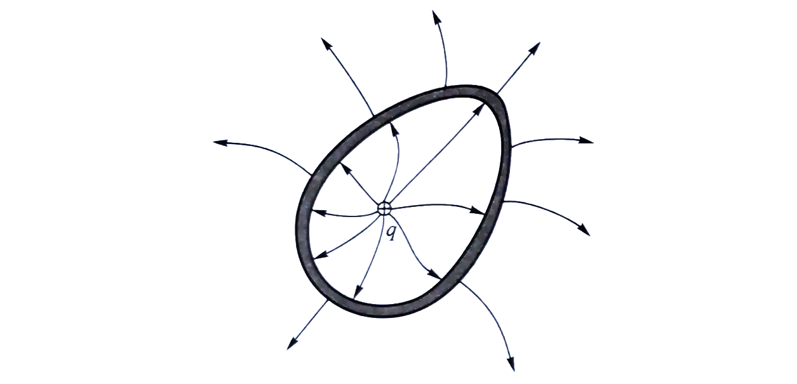
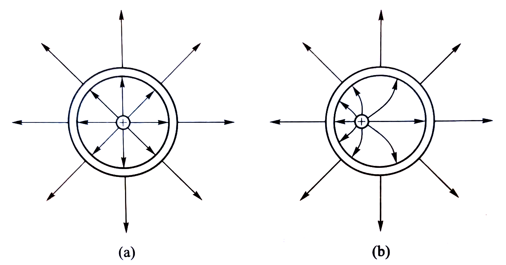

# ELEN30011 EDM Task

- Xiufu SUN 1372750
- Wenyang SUN 1354302

## 1.1

### 1.1.1

The electric field is given as:

$$
\mathbf{E} = \mathbf{E}(r, \phi, \theta) = E(r) \mathbf{\hat{r}}
$$

Gauss’s law states that the electric flux through a closed surface is proportional to the amount of charge. Because of the symmetry of the sphere, the charge is evenly distributed on the surface of the shell. Hence, the electric field must be radial. To apply Gauss’s law effectively in this configuration, the flux is equal everywhere on the sphere.
If the electric field had components in directions other than the radial direction, these components would cancel out when integrated over a symmetric spherical surface, leaving only the radial component. Hence, $\mathbf{E} = E(r) \mathbf{\hat{r}}$.

Moreover, if the shell is egg-shaped, its elctric field will be like this:

### 1.1.2

$$
\begin{align*}
   \rho_{in}(r) = (\frac{Q}{\pi a^4})r && Cm^{-3}
\end{align*}
$$

$$
\begin{align*}
   Q_{in}(r) &= \int_0^r\int_0^{2\pi}\int_0^{\pi} \rho_{in}(\alpha)\alpha^2 sin\theta d\theta d\phi d\alpha \\
   &= 2\pi \int_0^r\int_0^{\pi} (\frac{Q}{\pi a^4})\alpha^3 sin\theta d\theta d\alpha \\
   &= 4\pi (\frac{Q}{\pi a^4}) \int_0^r \alpha^3 d\alpha \\
   &= Q(\frac{r}{a})^4 & C
\end{align*}
$$

### 1.1.3

In 1.1.2, we get when $r \in [0, a]$, $Q_{in}(r) = Q(\frac{r}{a})^4$ C.

If $r \in (a, b)$, $\rho = 0$, $Q$ will be:

$$
\begin{align*}
   Q_{in}(r) &= \int_0^a\int_0^{2\pi}\int_0^{\pi} \rho_{in}(\alpha)\alpha^2 sin\theta d\theta d\phi d\alpha \\
   &= 2\pi \int_0^a\int_0^{\pi} (\frac{Q}{\pi a^4})\alpha^3 sin\theta d\theta d\alpha \\
   &= 4\pi (\frac{Q}{\pi a^4}) \int_0^a \alpha^3 d\alpha \\
   &= Q(\frac{a}{a})^4 \\
   &= Q & C
\end{align*}
$$

### 1.1.4

- Based on Gauss's law in its integral form states:

   $$
   \oint_{\partial V} \mathbf{E} \cdot d\mathbf{A} = \frac{Q_{in}}{\epsilon},
   $$

1. **For \(r \in [0, a]\)**:

   $$
   \begin{align*}
      Q_{in}(r) &= Q(\frac{r}{a})^4 & C
   \end{align*}
   $$

   Gauss's law:

   $$
   \oint_{\partial V} \mathbf{E} \cdot d\mathbf{A} = \frac{Q_{in}}{\epsilon},
   $$

   Solving $\oint_{\partial V} \mathbf{E} \cdot d\mathbf{A}$:

   $$
   \begin{align*}
   \oint_{\partial V} \mathbf{E} \cdot d\mathbf{A} &= \iint \mathbf{E} \cdot r^2 sin\phi d\phi d\theta \mathbf{\hat{r}}\\
   &= 4\pi r^2 \mathbf{E}(r)
   \end{align*}
   $$

   Hence, when $r \in [0, a]$:

   $$
   E(r) = \frac{Q(\frac{r}{a})^4}{4\pi \epsilon r^2} = \frac{Q}{4 \pi \epsilon a^2} \left(\frac{r}{a}\right)^2.
   $$

2. **For $r \in (a, b]$**:

   $$
   \begin{align*}
      Q_{in}(r) &= Q & C
   \end{align*}
   $$

   Gauss's law:

   $$
   \oint_{\partial V} \mathbf{E} \cdot d\mathbf{A} = 4\pi r^2 \mathbf{E}(r) = \frac{Q}{\epsilon}
   $$

   Hence, when $r \in (a, b)$:

   $$
   E(r) = \frac{Q}{4\pi \epsilon r^2} = \frac{Q}{4 \pi \epsilon a^2} \left(\frac{a}{r}\right)^2.
   $$

The electric field \(\mathbf{E}(r)\) in the interior and immediately surrounding the solid sphere is derived using Gauss's law and is given by:

$$
\mathbf{E}(r) = \frac{Q}{4 \pi \epsilon a^2}
\begin{cases}
   \left(\frac{r}{a}\right)^2 \hat{r}, & r \in [0, a], \\
   \left(\frac{a}{r}\right)^2 \hat{r}, & r \in (a, b].
\end{cases}
$$

## 1.2

### 1.2.1

The charge enclosed by that surface is zero. From Gauss'law $\oint \mathbf{E} d\mathbf{A} = 0$ this implies that the electric field inside a sphere is zero. If we add an electron inside the shell, the electrons on the surface will experience a force. This will cause them to move on the surface such that the net forcefield becomes zero again. The charge will move freely to counteract any electric field inside. Therefore, when a conductive spherical shell is in electronic equilbrium, there should be no net electric field present inside. This is because the charge within the conductor will redistribute itself so as to create opposing electric fields within the candutert to cancel out any electric field present within it.

### 1.2.2

Based on the answer to 1.2.1,we knew that the value of electric field in the interval from $r \in (b, b + d)$ is zero. According to the formula of flux: $\oiint_{\mathbf{A}} \mathbf{E} d\mathbf{A}$, because of $\mathbf{E} = \mathbf{0}$ the flux $\oiint_{\mathbf{A}} \mathbf{E} d\mathbf{A} = 0$.
$Q = \mathbf{E} \cdot \phi$ because of $\mathbf{E} = 0, Q = 0$, thus the total charge contained with this test surface must be zero.

### 1.2.3

The spherical shell is uniform and symmetrical.

## 1.3

### 1.3.1

If $r \in (b, b + d)$, $Q$ will be:

$$
\begin{align*}
   Q(r) &= \int_0^a\int_0^{2\pi}\int_0^{\pi} \rho_{in}(\alpha)\alpha^2 sin\theta d\theta d\phi d\alpha \\
   &= 2\pi \int_0^a\int_0^{\pi} (\frac{Q}{\pi a^4})\alpha^3 sin\theta d\theta d\alpha \\
   &= 4\pi (\frac{Q}{\pi a^4}) \int_0^a \alpha^3 d\alpha \\
   &= Q(\frac{a}{a})^4 \\
   &= Q & C
\end{align*}
$$

### 1.3.2

Yes.

## 2.1

### 2.1.1

Since the direction and magnitude of the symmetric magnetic field of the cylinder, E depend solely on the radial distance r from the axis, independent of the Angle ϕ (as shown in Part 1).  As H is perpendicular to E, H has no component in the r direction. J is uniform along the z direction, H has no component in the z direction either.

Using Ampere’s law:

$$
\begin{align*}
   \oint_{l(A)} \mathbf{H} \cdot d\mathbf{l} = \iint_{A(l)} \mathbf{J} \cdot d\mathbf{A} + \iint_{A(l)} \frac{d\mathbf{D}}{dt} \cdot d\mathbf{A}
\end{align*}
$$

The electric field does not change with time.

$$
\begin{align*}
   \oint_{l(A)} \mathbf{H} \cdot d\mathbf{l} = \iint_{A(l)} \mathbf{J} \cdot d\mathbf{A} = I
\end{align*}
$$

Using the right-hand rule, we can determine the direction and nature of the magnetic field generated by the current.

$$
\begin{align*}
   \mathbf{H}(r, \phi, z) = H_{\phi} \mathbf{\hat{\phi}} && Am^{-1}
\end{align*}
$$

### 2.1.2

From Cartesian coordinates to cylindrical coordinates:

$$
\begin{align*}
   d\mathbf{A} = rd\theta dr \mathbf{\hat{z}}
\end{align*}
$$

Based on the definition of current:

$$
\begin{align*}
   I_{core}(r) &= \iint_{A(l)} \mathbf{J} \cdot d\mathbf{A} \\
   &= \int_0^{r} \int_0^{2\pi} J_{core}(\alpha) \mathbf{\hat{z}} \cdot \alpha d\theta d\alpha \mathbf{\hat{z}} \\
   &= \int_0^{r} \frac{3I\alpha^2}{a^3} d\alpha \\
   &= I(\frac{r}{a})^3 & A
\end{align*}
$$

The total current is $I$:

$$
\begin{align*}
   I = I_{core}(a) = I(\frac{a}{a})^3 = I && A
\end{align*}
$$

### 2.1.3

We've already got $\oint_{l(A)} \mathbf{H} \cdot d\mathbf{l} = \iint_{A(l)} \mathbf{J} \cdot d\mathbf{A} = I$ in 2.1.1.

$r \in (0, a]$,

$$
\begin{align*}
\iint_{A(l)} \mathbf{J} \cdot d\mathbf{A} = I(\frac{r}{a})^3 && A
\end{align*}
$$

When $r \in (a, b]$,

$$
\begin{align*}
   I = I_{core}(a) = I(\frac{a}{a})^3 = I && A
\end{align*}
$$

For $\oint_{l(A)} \mathbf{H} \cdot d\mathbf{l}$, we have known that $\mathbf{H}$ is in the $\phi$ direction.

$$
\begin{align*}
   \oint_{l(A)} \mathbf{H} \cdot d\mathbf{l} &= r H_{\phi} \int_0^{2\pi} d\phi \\
   &= 2\pi r H_{\phi} & A
\end{align*}
$$

Hence, when $r \in (0, a]$

$$
\begin{align*}
   2\pi r H_{\phi} = I(\frac{r}{a})^3 \\
   \Rightarrow H_{\phi} = I(\frac{r^2}{2\pi a^3})
\end{align*}
$$

When $r \in (a, b]$

$$
\begin{align*}
   2\pi r H_{\phi} = I \\
   \Rightarrow H_{\phi} = \frac{I}{2\pi r}
\end{align*}
$$

Hence,

$$
\mathbf{H}(r) = \frac{I}{2 \pi a}
\begin{cases}
   \left(\frac{r}{a}\right)^2 \hat{\phi}, & r \in [0, a], \\
   \left(\frac{a}{r}\right) \hat{\phi}, & r \in (a, b].
\end{cases}
$$

## 2.2

### 2.2.1

Based on the definition of current, when $r \in (b,(b+d)]$,

$$
\begin{align*}
   I_{shield} &= \iint_{A(l)} \mathbf{J} \cdot d\mathbf{A} \\
   &= \int_b^{b+d} \int_0^{2\pi} J_{shield}(\alpha) \mathbf{\hat{z}} \cdot \alpha d\theta d\alpha \mathbf{\hat{z}} \\
   &= \frac{-I}{\pi[(b+d)^2 - b^2]} \int_b^{b+d} 2\pi \alpha d\alpha \\
   &= \frac{-I}{\pi[(b+d)^2 - b^2]} \times \pi[(b+d)^2 - b^2] \\
   &= -I & A
\end{align*}
$$

### 2.2.2

Ampère's circuital law shows that,

$$
\begin{align*}
   {\displaystyle \oint _{\mathbb {C} }\mathbf {B} \cdot \mathrm {d} {\boldsymbol {\ell }}=\mu _{0}I_{\text{enc}}}
\end{align*}
$$

When the loop contains both core and shield, $\sum I = I_{core} + I_{shield} = 0$.

Hence,

$$
\begin{align*}
   {\displaystyle \oint _{\mathbb {C} }\mathbf {B} \cdot \mathrm {d} {\boldsymbol {\ell }} = 0 }
\end{align*}
$$

The magnetic field is zero outside the shield.
