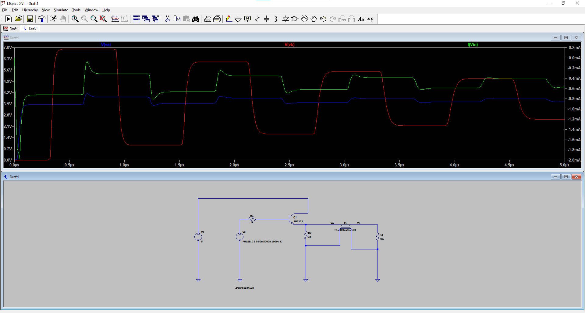

# ELEN30011 EDM Task

- Xiufu SUN 1372750
- Wenyang SUN 1354302

## Part 1

### 1.1

## Part 2

### 2.1

In figure 3,

$$
\begin{align}
    r_1 = \sqrt{(x+s)^2 + y^2} \\
    r_2 = \sqrt{(s-x)^2 + y^2}
\end{align}
$$

$U(\mathbf{P})$ is a constant

$$
\begin{align}
    k = \frac{r_1}{r_2} = \frac{\sqrt{(x+s)^2 + y^2}}{\sqrt{(s-x)^2 + y^2}}
\end{align}
$$

Hence,

$$
\begin{align}
    k^2 = \frac{r_1^2}{r_2^2} = \frac{(x+s)^2 + y^2}{(s-x)^2 + y^2} \\
    \Rightarrow (s+x)^2 + y^2 = k^2 [(s-x)^2 + y^2]
\end{align}
$$

### 2.2

Given

$$
\begin{align}
    (x - s\frac{k^2 + 1}{k^2 - 1})^2 + y^2 = (\frac{2ks}{k^2 - 1})^2 \\
\end{align}
$$

Replace k with x and y:

$$
\begin{align*}
    (x - s\frac{(s+x)^2+(s-x)^2+2y^2}{(s+x)^2 - (s-x)^2})^2 + y^2 &= (x - \frac{s^2+x^2+y^2}{2x})^2 + y^2\\
    &= (\frac{x^2+y^2 - s^2}{2x})^2 + y^2
\end{align*}
$$

$$
\begin{align*}
    (\frac{2ks}{k^2 - 1})^2 &= 
\end{align*}
$$

## Part 3

### 3.1

1. Input Signal (VIN):
The VIN waveform appears to be a square wave, switching between 0V and approximately 5V.

2. Waveform at Point VA:
The waveform at VA (green) shows significant signal distortion, especially during transitions where there is noticeable overshoot and ringing. This indicates that as the signal reaches the input of the cable, it begins to distort due to circuit characteristics and impedance mismatches.

3. Waveform at Point VB:
The waveform at VB (red) also exhibits considerable signal distortion, which is even more pronounced than at VA. This suggests that the distortion increases as the signal propagates through the 60-meter cable, resulting in significant overshoot and ringing on both the rising and falling edges of the waveform.

#### **Conclusion:**

Based on the simulation results, we can conclude the following:
Signal distortion is a significant issue in this network interconnection. The simulation waveforms indicate that there is noticeable distortion, especially at VA andVB points, which worsens as the signal passes through the cable. This distortion could lead to signal integrity problems, potentially affecting the accuracy of data transmission. If this signal distortion is not properly addressed in real applications, it may result in an increased bit error rate or even data transmission failures.

### 3.2

