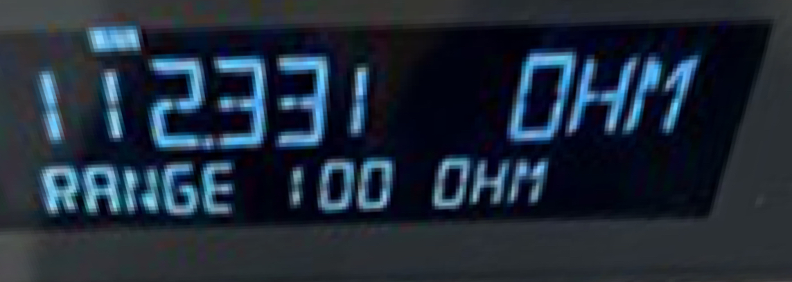

# ELEN30011 EDM Task

- Xiufu SUN 1372750
- Wenyang SUN 1354302

## Part 1

### 1.1

The permittivity $\epsilon$ would be influenced by the capacitors' material.

Formular (4) (5) and (6) shows the relationship between $V$, $\mathbf E$, $\mathbf{D}$ and $q$.

Among them, formula (6) shows the effect of capacitive material: $\mathbf{D} = \epsilon \mathbf{E}$, which means when the electric field strength $\mathbf{E}$ is equal, these capacitors with different material can have different $\mathbf{D}$, and vice versa.

The remaining two formulas show that the voltage is the integral of the electric field along the path, and that the electric flux density is equal to the charge wrapped in the surface, respectively. Only the relationship between the electric flux density and the electric field is affected by the capacitive material.

### 1.2

The distance between capacitor plates and the size of the capacitor plates.

Formula (4) shows if the electric field is the same, the longer the path, the higher the voltage.

Formula (5) shows in the case of the same charge density, the larger the integral surface, the higher the electric field.

Hence, if the materials is the same, the larger the capacitor, the larger its value.

## Part 2

### 2.1

#### 2.1.1

In figure 3,

$$
\begin{align}
    r_1 = \sqrt{(x+s)^2 + y^2} \\
    r_2 = \sqrt{(s-x)^2 + y^2}
\end{align}
$$

$U(\mathbf{P})$ is a constant

$$
\begin{align}
    k = \frac{r_1}{r_2} = \frac{\sqrt{(x+s)^2 + y^2}}{\sqrt{(s-x)^2 + y^2}}
\end{align}
$$

Hence,

$$
\begin{align}
    k^2 = \frac{r_1^2}{r_2^2} = \frac{(x+s)^2 + y^2}{(s-x)^2 + y^2} \\
    \Rightarrow (s+x)^2 + y^2 = k^2 [(s-x)^2 + y^2]
\end{align}
$$

#### 2.1.2

Given

$$
\begin{align}
    (x - s\frac{k^2 + 1}{k^2 - 1})^2 + y^2 = (\frac{2ks}{k^2 - 1})^2 \\
\end{align}
$$

Replace k with x and y, the left side of the equation:

$$
\begin{align*}
    (x - s\frac{(s+x)^2+(s-x)^2+2y^2}{(s+x)^2 - (s-x)^2})^2 + y^2 &= (x - \frac{s^2+x^2+y^2}{2x})^2 + y^2\\
    &= (\frac{x^2 - y^2 - s^2}{2x})^2 + y^2 \\
    &= \frac{x^4+y^4+s^4+2x^2y^2-2x^2s^2+2y^2s^2}{4x^2}
\end{align*}
$$

The right side of the equation:

$$
\begin{align*}
    (\frac{2ks}{k^2 - 1})^2 &= (2ks\frac{(s-x)^2 + y^2}{(s+x)^2 - (s-x)^2})^2 \\
    &= 4k^2(\frac{(s-x)^2 + y^2}{4x})^2 \\
    &= \frac{(x+s)^2 + y^2}{(s-x)^2 + y^2} (\frac{(s-x)^2 + y^2}{2x})^2 \\
    &= \frac{[(s+x)^2 + y^2][(s-x)^2 + y^2]}{4x^2} \\
    &= \frac{[(s+x)^2(s-x)^2 + y^2(s-x)^2 + y^2(s+x)^2 + y^4]}{4x^2} \\
    &= \frac{x^4+y^4+s^4+2x^2y^2-2x^2s^2+2y^2s^2}{4x^2}
\end{align*}
$$

Hence, the equation holds.

#### 2.1.3

The coordinates of the center of the circle are:

$$
\begin{align}
    (s\frac{k^2+1}{k^2-1}, 0)
\end{align}
$$

Its radius is:

$$
\begin{align}
    R = \frac{2ks}{k^2-1}
\end{align}
$$

#### 2.1.4

Based on figure 3,

$$
\begin{align}
    a = R = \frac{2ks}{k^2-1} \\
    h = s\frac{k^2+1}{k^2-1}
\end{align}
$$

#### 2.1.5

$$
\begin{align*}
    \frac{h}{a} &= \frac{k^2 + 1}{2k} \\
    0 &= k^2 - 2(\frac{h}{a})k + 1 \\
    [k - (\frac{h}{a})]^2 &= (\frac{h}{a})^2 - 1 \\
    \Rightarrow k_{1,2} &= \frac{h}{a} \pm \sqrt{(\frac{h}{a})^2 - 1}
\end{align*}
$$

$$
\begin{align}
    k^- = \frac{h}{a} - \sqrt{(\frac{h}{a})^2 - 1} &,& k^+ = \frac{h}{a} + \sqrt{(\frac{h}{a})^2 - 1}
\end{align}
$$

$$
\begin{align}
    k^- k^+ = (\frac{h}{a} - \sqrt{(\frac{h}{a})^2 - 1})(\frac{h}{a} + \sqrt{(\frac{h}{a})^2 - 1}) = 1
\end{align}
$$

If $h > a$, $\frac{h}{a} > 1$, $(\frac{h}{a})^2 - 1 > 0$

$$
\begin{align}
    k^+ = \frac{h}{a} + \sqrt{(\frac{h}{a})^2 - 1} > 1
\end{align}
$$

$$
\begin{align}
    k^- = \frac{1}{k^+} \Rightarrow k^- \in (0,1)
\end{align}
$$

#### 2.1.6

In Question 2.1.4, $a = \frac{2ks}{k^2-1} \Rightarrow s = \frac{k^2-1}{k} \frac{a}{2}$.

For $k^+ > 1$,

$$
\begin{align}
    s^+ = (\frac{(k^+)^2-1}{k^+}) \frac{a}{2} > 0
\end{align}
$$

For $k^- \in (0,1)$,

$$
\begin{align}
    s^- = (\frac{(k^-)^2-1}{k^-}) \frac{a}{2} < 0
\end{align}
$$

Since $k = \frac{r_1}{r_2}$, if it is located at the surface of the positively charged wires $r_1 > r_2$, $k^+ > 1$. Hence, $(k^+,s^+)$ correspond to the surface of positively charged wires.

If $r_1 < r_2$, $k^- \in (0,1)$, $s^- < 0$. Hence, $(k^-,s^-)$ correspond to the surface of negative charged wires.

### 2.2  Potential and the electric field

#### 2.2.3

#### 2.2.4

### 2.3

## Part 3 Capacitance in CAT5 UTP network cables

### 3.1 Preliminary calculations

#### 3.1.1

the characteristic impedance and propagation delay per unit length for CAT5 UTP cable are $Z_0 = 100\Omega$, $D = 5 ns/m$.

$$
\begin{align*}
    Z_0 = \sqrt{\frac{\hat{L}}{\hat{C}}} = 100 \\
    D = \sqrt{\hat{L}\hat{C}} = 5 \times 10^{-9}
\end{align*}
$$

Hence,

$$
\begin{align}
    \hat{L} = 5 \times 10^{-7} H/m \\
    \hat{C} = 5 \times 10^{-11} F/m
\end{align}
$$

#### 3.1.3

Given $L = 60m$, $D = 5ns/m$, hence

$$
\begin{align}
    T_d = 5ns/m \times 60 m = 300ns \\
    \Rightarrow f_{RING} = \frac{1}{2\pi T_d} \approx 530516.5 Hz \\
    f_{KNEE} = \frac{0.5}{t_{sw}} = \frac{0.5}{10^{-8}} = 5 \times 10^{7} Hz
\end{align}
$$

#### 3.1.4

Since $f_{KNEE} >> f_{RING}$, the signal distortion will be a significant
 issue for this combination of signal and cable.

### 3.2 Simulation

#### 3.2.1

$T_d = 300ns$ and $Z_0 = 100\Omega$:

#### 3.2.2

The simulation waveform is as follows (green-Va,blue-Vb):

Use cursors to measure the delay:

We measure $T_d \approx 300ns$.

#### 3.2.3

Yes, signal distortion is a significant issue for this network interconnection.

In low frequency signals, this problem of signal distortion may not be a significant issue. However, in high frequency circuits, we need to consider the problem of impedance matching. The reflected signal superimposed on the original signal will change the shape of the original signal and cause distortion. This distortion could lead to signal integrity problems, potentially affecting the accuracy of data transmission.

(We can use Smith's chart to deal with this problem.)

#### 3.2.4

$R = 150\Omega$:

$R = 100\Omega$:

$R = 90\Omega$:

After adjusting the resistance value of the resistor several times, we believe that there is no distortion when $R = 100\Omega$ (impedance matching). It equals to $Z_0$.

### 3.3 Hardware investigation

#### 3.3.1

- Green - Green: $5.566\Omega$
- White - White: $5.522\Omega$
- Black - Black: $1.934\Omega$
- Red - Red: $1.954\Omega$

### 3.3.2

We use Green and White line. The blue line on the bottom is Va and the yellow line on the top is Vb.

#### 3.3.3

Yes. As shown in 3.2.3, we think it is an impedance mismatch problem. The reflected signal superimposed on the original signal will change the shape of the original signal and cause distortion. This distortion could lead to signal integrity problems, potentially affecting the accuracy of data transmission.

Moreover, we notice that the measured signal is even more distorted:

- Breadboards, wires and the environments may introduce more noise.
- Measurements are inevitably subject to error.
- Because of Gibbs phenomenon, the input square wave will overshoot(9%).

#### 3.3.4

Move the cursors to measure rise time and delay:

As shown in the figure, rise time $t_{SW}$ of $V_A$ is 100ns.

The measured value $T_{d} = 288ns$.

Hence,

$$
\begin{align}
    D = \frac{288ns}{60m} = 4.8ns/m \\
    f_{RING} = \frac{1}{2\pi T_d} \approx 552621.33 Hz \\
    f_{KNEE} = \frac{0.5}{t_{sw}} = \frac{0.5}{10^{-7}} = 5 \times 10^{6} Hz
\end{align}
$$

$f_{KNEE}$ is 10 times larger than $f_{RING}$, the distortion still exists.

#### 3.3.5

By adjusting the variable resistance, we make the output waveform as follows:

It is measured that the resistance at this time is $R = 112\Omega$:

We've got $D = 4.8ns/m$, $Z_0 = R = 112\Omega$ (Impedance matching).

$$
\begin{align*}
    Z_0 = \sqrt{\frac{\hat{L}}{\hat{C}}} = 112 \\
    D = \sqrt{\hat{L}\hat{C}} = 4.8 \times 10^{-9}
\end{align*}
$$

Hence,

$$
\begin{align}
    \hat{L} = 5.3 \times 10^{-7} H/m \\
    \hat{C} = 4.3 \times 10^{-11} F/m
\end{align}
$$

So we estimate from our measurements $\hat{L} = 5.3 \times 10^{-7} H/m$ and $\hat{C} = 4.3 \times 10^{-11} F/m$.
