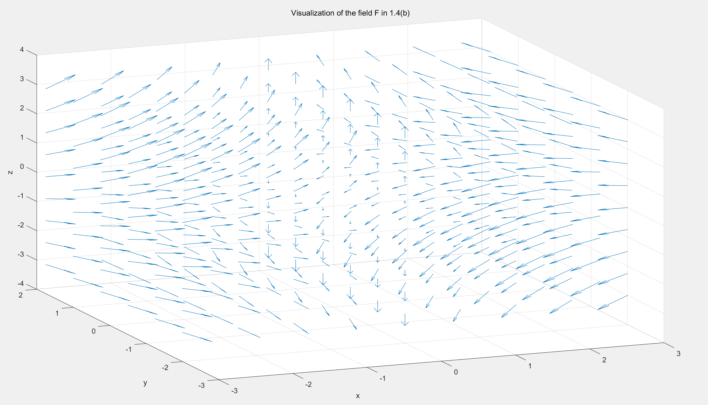
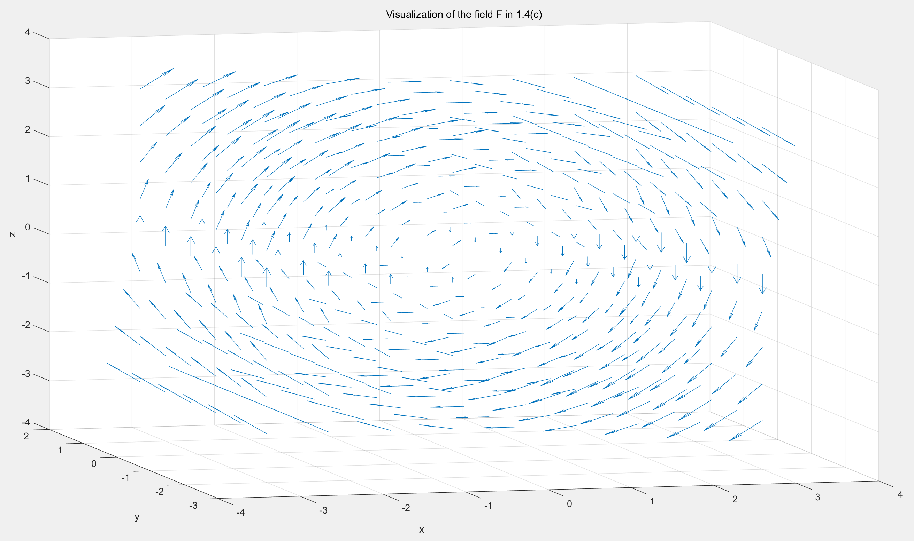
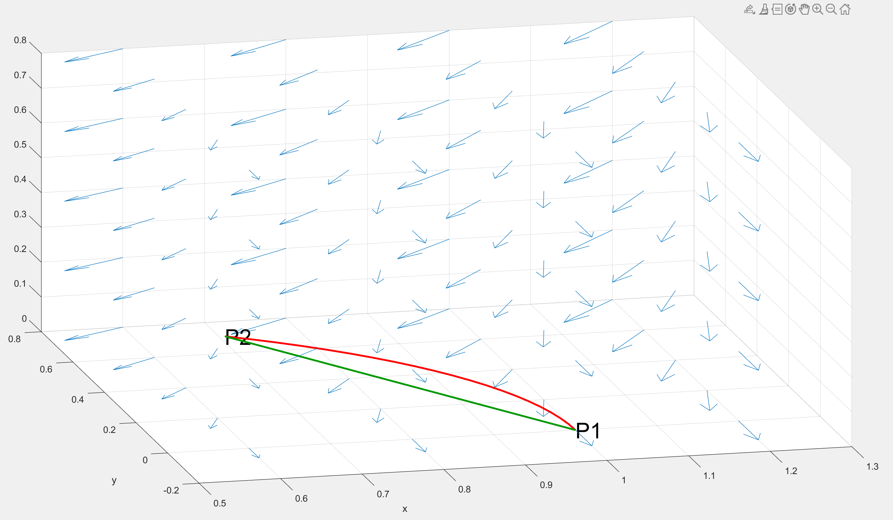
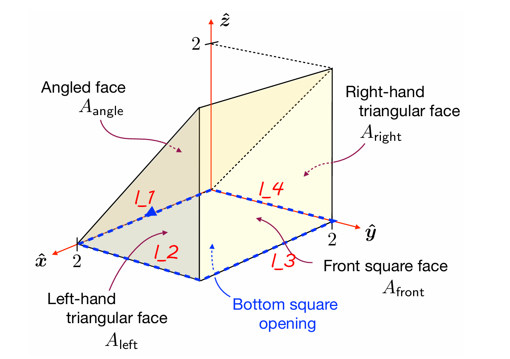

# ELEN30011 EDM Task

- Xiufu SUN 1372750
- Wenyang SUN 1354302

## 1.1

${\bf{\nabla \cdot F}}$ (div $\bf{F}$) is a scalar, ${\bf{\nabla \times F}}$ is a vector field.

Explaination: $\Downarrow$

## 1.2

Let $\bf{F}$ : $\mathbb{R^3} \to \mathbb{R^3}$ be a vector field with

$$
{\bf{F}}(x, y, z) = F_x(x, y, z){\bf{\hat{x}}} + F_y(x, y, z){\bf{\hat{y}}} + F_z(x, y, z){\bf{\hat{z}}}
$$

The divergence of $\bf{F}$ (div $\bf{F}$) is

$$
\begin{align*}
    {\bf{\nabla \cdot F}} &= (\frac{\partial}{\partial{x}}, \frac{\partial}{\partial{y}}, \frac{\partial}{\partial{z}})\cdot (F_x, F_y, F_z) \\
    &= \frac{\partial{F_x}}{\partial{x}} + \frac{\partial{F_y}}{\partial{y}} + \frac{\partial{F_z}}{\partial{z}}
\end{align*}
$$

${\bf{\nabla \cdot F}}$ is a scalar.

$$
\begin{align*}
{\bf{\nabla \times F}} &= (\frac{\partial}{\partial{x}}{\bf{\hat{x}}} + \frac{\partial}{\partial{y}}{\bf{\hat{y}}} + \frac{\partial}{\partial{z}}{\bf{\hat{z}}}) \times (F_x(x, y, z){\bf{\hat{x}}} + F_y(x, y, z){\bf{\hat{y}}} + F_z(x, y, z){\bf{\hat{z}}}) \\
&=
\begin{vmatrix}
    {\bf{\hat{x}}} &{\bf{\hat{y}}} &{\bf{\hat{z}}} \\
    \frac{\partial}{\partial{x}} & \frac{\partial}{\partial{y}} & \frac{\partial}{\partial{z}} \\
    F_x & F_y & F_z
\end{vmatrix} \\
&= (\frac{\partial{F_z}}{\partial{y}} - \frac{\partial{F_y}}{\partial{z}}){\bf{\hat{x}}} + (\frac{\partial{F_x}}{\partial{z}} - \frac{\partial{F_z}}{\partial{x}}){\bf{\hat{y}}} + (\frac{\partial{F_x}}{\partial{y}} - \frac{\partial{F_y}}{\partial{x}}){\bf{\hat{z}}}
\end{align*}
$$

${\bf{\nabla \times F}}$ is a vector field.

## 1.3

(a)

$$
grad f = \nabla{f} = \frac{\partial{f}}{\partial{x}}{\bf{\hat{x}}} + \frac{\partial{f}}{\partial{y}}{\bf{\hat{y}}} + \frac{\partial{f}}{\partial{z}}{\bf{\hat{z}}} = 0{\bf{\hat{x}}} + 0{\bf{\hat{y}}} + 0{\bf{\hat{z}}}
$$

(b)

$$
grad f = \nabla{f} = \frac{\partial{f}}{\partial{x}}{\bf{\hat{x}}} + \frac{\partial{f}}{\partial{y}}{\bf{\hat{y}}} + \frac{\partial{f}}{\partial{z}}{\bf{\hat{z}}} = 1{\bf{\hat{x}}} + z{\bf{\hat{y}}} + y{\bf{\hat{z}}}
$$

(c)

$$
grad f = \nabla{f} = \frac{\partial{f}}{\partial{x}}{\bf{\hat{x}}} + \frac{\partial{f}}{\partial{y}}{\bf{\hat{y}}} + \frac{\partial{f}}{\partial{z}}{\bf{\hat{z}}} = x{\bf{\hat{x}}} + (y+\frac{1}{2}z^2 siny){\bf{\hat{y}}} - zcosy{\bf{\hat{z}}}
$$

(d)

$$
grad f = \nabla{f} = \frac{\partial{f}}{\partial{x}}{\bf{\hat{x}}} + \frac{\partial{f}}{\partial{y}}{\bf{\hat{y}}} + \frac{\partial{f}}{\partial{z}}{\bf{\hat{z}}} = \frac{-x}{x^2 + y^2 + z^2}{\bf{\hat{x}}} + \frac{-y}{x^2 + y^2 + z^2}{\bf{\hat{y}}} + \frac{-z}{x^2 + y^2 + z^2}{\bf{\hat{z}}}
$$

## 1.4

(a)

$$
div {\bf{F}} = {\bf{\nabla \cdot F}} = \frac{\partial{F_x}}{\partial{x}} + \frac{\partial{F_y}}{\partial{y}} + \frac{\partial{F_z}}{\partial{z}} = 0
$$

$$
curl {\bf{F}} = {\bf{\nabla \times F}} =
\begin{vmatrix}
    {\bf{\hat{x}}} &{\bf{\hat{y}}} &{\bf{\hat{z}}} \\
    \frac{\partial}{\partial{x}} & \frac{\partial}{\partial{y}} & \frac{\partial}{\partial{z}} \\
    F_x & F_y & F_z
\end{vmatrix} =
\begin{vmatrix}
    {\bf{\hat{x}}} &{\bf{\hat{y}}} &{\bf{\hat{z}}} \\
    \frac{\partial}{\partial{x}} & \frac{\partial}{\partial{y}} & \frac{\partial}{\partial{z}} \\
    0 & 0 & 0
\end{vmatrix} = 0{\bf{\hat{x}}} + 0{\bf{\hat{y}}} + 0{\bf{\hat{z}}}
$$

(b)

$$
div {\bf{F}} = {\bf{\nabla \cdot F}} = \frac{\partial{F_x}}{\partial{x}} + \frac{\partial{F_y}}{\partial{y}} + \frac{\partial{F_z}}{\partial{z}} = -1 + 1 = 0
$$

$$
curl {\bf{F}} = {\bf{\nabla \times F}} =
\begin{vmatrix}
    {\bf{\hat{x}}} &{\bf{\hat{y}}} &{\bf{\hat{z}}} \\
    \frac{\partial}{\partial{x}} & \frac{\partial}{\partial{y}} & \frac{\partial}{\partial{z}} \\
    F_x & F_y & F_z
\end{vmatrix} =
\begin{vmatrix}
    {\bf{\hat{x}}} &{\bf{\hat{y}}} &{\bf{\hat{z}}} \\
    \frac{\partial}{\partial{x}} & \frac{\partial}{\partial{y}} & \frac{\partial}{\partial{z}} \\
    -x & 0 & z
\end{vmatrix} = 0{\bf{\hat{x}}} + 0{\bf{\hat{y}}} + 0{\bf{\hat{z}}}
$$

(c)

$$
div {\bf{F}} = {\bf{\nabla \cdot F}} = \frac{\partial{F_x}}{\partial{x}} + \frac{\partial{F_y}}{\partial{y}} + \frac{\partial{F_z}}{\partial{z}} = 0
$$

$$
curl {\bf{F}} = {\bf{\nabla \times F}} =
\begin{vmatrix}
    {\bf{\hat{x}}} &{\bf{\hat{y}}} &{\bf{\hat{z}}} \\
    \frac{\partial}{\partial{x}} & \frac{\partial}{\partial{y}} & \frac{\partial}{\partial{z}} \\
    F_x & F_y & F_z
\end{vmatrix} =
\begin{vmatrix}
    {\bf{\hat{x}}} &{\bf{\hat{y}}} &{\bf{\hat{z}}} \\
    \frac{\partial}{\partial{x}} & \frac{\partial}{\partial{y}} & \frac{\partial}{\partial{z}} \\
    z & 0 & -x
\end{vmatrix} = [1 - (-1)] {\bf{\hat{y}}} = 2 {\bf{\hat{y}}}
$$

(d)

$$
div {\bf{F}} = {\bf{\nabla \cdot F}} = \frac{\partial{F_x}}{\partial{x}} + \frac{\partial{F_y}}{\partial{y}} + \frac{\partial{F_z}}{\partial{z}} = \frac{\partial^2{f}}{\partial{x^2}} + \frac{\partial^2{f}}{\partial{y}} + \frac{\partial^2{f}}{\partial{z^2}}
$$

$$
\begin{align*}
curl {\bf{F}} = {\bf{\nabla \times F}} &=
\begin{vmatrix}
    {\bf{\hat{x}}} &{\bf{\hat{y}}} &{\bf{\hat{z}}} \\
    \frac{\partial}{\partial{x}} & \frac{\partial}{\partial{y}} & \frac{\partial}{\partial{z}} \\
    F_x & F_y & F_z
\end{vmatrix} =
\begin{vmatrix}
    {\bf{\hat{x}}} &{\bf{\hat{y}}} &{\bf{\hat{z}}} \\
    \frac{\partial}{\partial{x}} & \frac{\partial}{\partial{y}} & \frac{\partial}{\partial{z}} \\
    \frac{\partial{f}}{\partial{x}} & \frac{\partial{f}}{\partial{y}} & \frac{\partial{f}}{\partial{z}}
\end{vmatrix} \\
&= (\frac{\partial^2{f}}{\partial{y}\partial{z}} - \frac{\partial^2{f}}{\partial{z}\partial{y}}){\bf{\hat{x}}} + (\frac{\partial^2{f}}{\partial{z}\partial{x}} - \frac{\partial^2{f}}{\partial{x}\partial{z}}){\bf{\hat{y}}} + (\frac{\partial^2{f}}{\partial{y}\partial{x}} - \frac{\partial^2{f}}{\partial{x}\partial{y}}){\bf{\hat{z}}} \\
&= 0{\bf{\hat{x}}} + 0{\bf{\hat{y}}} + 0{\bf{\hat{z}}}
\end{align*}
$$

## 1.5

```Matlab
close all
clear
clc

x = -3:.75:3;
y = -2:.75:2;
z = -3:.75:3;

[X, Y, Z] = meshgrid(x, y, z);

FX = -X;
FY = 0.*Y;
FZ = Z;

figure(1);
quiver3(X,Y,Z,FX,FY,FZ)
xlabel("x");
ylabel("y");
zlabel("z");
title("Visualization of the field F in 1.4(b)")
```



```Matlab
close all
clear
clc

x = -3:.75:3;
y = -2:.75:2;
z = -3:.75:3;

[X, Y, Z] = meshgrid(x, y, z);

FX = Z;
FY = 0.*Y;
FZ = -X;

figure(1);
quiver3(X,Y,Z,FX,FY,FZ)
xlabel("x");
ylabel("y");
zlabel("z");
title("Visualization of the field F in 1.4(c)")
```



## 2.1

### 2.1.1

${\bf{l_1}}$ is a straight line.

$$
{\bf{l_1}}(s) = (1-s) {\bf{P_1}} + s {\bf{P_2}}
$$

${\bf{l_2}}$ is circular arc of radius 1.

Let $x = cos(\frac{\pi s}{4})$, $y = sin(\frac{\pi s}{4})$.

$$
x^2 + y^2 = cos^2(\frac{\pi s}{4}) + sin^2(\frac{\pi s}{4}) = 1
$$

In cartesian coordinates, $x^2 + y^2 = 1$ is describing a circle with a radius of 1.

Plus, since $s \in [0, 1]$, $x \in [\frac{\sqrt2}{2}, 1]$, $y \in [0, \frac{\sqrt2}{2}]$.

When s increases, ${\bf{l_2}}$ moves from $(1, 0)$ to $(\frac{\sqrt2}{2}, \frac{\sqrt2}{2})$ along this circle, anticlockwise.

### 2.1.2

Fomular (8) shows that,

$$
{\bf{E}}(x, y, z) = -y {\bf{\hat{x}}} - x {\bf{\hat{y}}}
$$

For ${\bf{l_1}}$, $x = 1 - s + \frac{s}{\sqrt{2}}$, $y = \frac{s}{\sqrt{2}}$

$$
{\bf{E}}({\bf{l_1}}(s)) = -\frac{s}{\sqrt{2}} {\bf{\hat{x}}} - (1 - s + \frac{s}{\sqrt{2}}) {\bf{\hat{y}}}
$$

For ${\bf{l_2}}$, $x = cos(\frac{\pi s}{4})$, $y = sin(\frac{\pi s}{4})$

$$
{\bf{E}}({\bf{l_2}}(s)) = -sin(\frac{\pi s}{4}) {\bf{\hat{x}}} - cos(\frac{\pi s}{4}) {\bf{\hat{y}}}
$$

### 2.1.3

```Matlab
x = 0.6:.2:1.2; y = 0:.2:.8; z = 0:.2:.8;
[xx,yy,zz] = meshgrid(x,y,z);
Exx =-yy; Eyy =-xx; Ezz = 0*xx;
figure(2);
quiver3(xx,yy,zz,Exx,Eyy,Ezz);
grid on; hold on;
xhat = [1;0;0]; yhat = [0;1;0];
s = 0:.05:1;
L1 = (1- s).*xhat + s.*(xhat + yhat)/sqrt(2);
L2 = cos(pi .*s ./4).*xhat + sin(pi .*s ./4).*yhat;
plot3(L1(1,:),L1(2,:),L1(3,:),'Color',[0 .6 0],'LineWidth',2);
plot3(L2(1,:),L2(2,:),L2(3,:),'Color',[1 0 0],'LineWidth',2);
xlabel("x")
ylabel("y")
text(1,0,0,"P1","FontSize",24)
text(1/sqrt(2), 1/sqrt(2), 0, "P2", "FontSize",24)
```



### 2.1.4

There is no singularity here, the result is not related to the path.

$$
\begin{align*}
V_{l_1} &= -\int_{l_1} {\bf{E}} \cdot dl_1 \\
&= -\int_{l_1} {\bf{E}(l_1(s))} \cdot \frac{d{\bf{l_1}}}{ds}(s) ds \\
&= -\int_s(-\frac{s}{\sqrt{2}}, - (1 - s + \frac{s}{\sqrt{2}}))(-1 + \frac{1}{\sqrt{2}}, \frac{1}{\sqrt{2}})ds \\
&= -\int_0^1 \sqrt{2} s - s - \frac{\sqrt{2}}{2} ds \\
&= \frac{1}{2}
\end{align*}
$$

$$
\begin{align*}
V_{l_2} &= -\int_{l_2} {\bf{E}} \cdot dl_2 \\
&= -\int_{l_2} {\bf{E}(l_2(s))} \cdot \frac{d{\bf{l_2}}}{ds}(s) ds \\
&= -\int_s(-sin(\frac{\pi s}{4}), -cos(\frac{\pi s}{4}))(-\frac{\pi}{4}sin(\frac{\pi s}{4}), \frac{\pi}{4}cos(\frac{\pi s}{4}))ds \\
&= \int_0^1 cos^2(\frac{\pi s}{4}) - sin^2(\frac{\pi s}{4}) ds \\
&= \frac{\pi}{4}\int_0^1 cos(\frac{\pi s}{2}) ds \\
&= \frac{\pi}{4} \times \frac{2}{\pi}sin(\frac{\pi s}{2})|_{s=0}^{s=1} \\
&= \frac{1}{2}
\end{align*}
$$

- Force:
$${\bf{F}} = q{\bf{E}}$$
- Work:
$$W = -\int_l {\bf{F}} dl = -q\int_l {\bf{E}} dl$$
- Voltage
$$V = \frac{W}{q} = -\int_l {\bf{E}} dl$$

### 2.1.5

Since ${\bf{E}}(x, y, z) = -y {\bf{\hat{x}}} - x {\bf{\hat{y}}}$ (shown in Fomular 8)

This field is static,

$$
-\nabla{U} = E
$$

$$
\begin{align*}
\frac{\partial{U}}{\partial{x}} = y \\
\frac{\partial{U}}{\partial{y}} = x
\end{align*}
$$

Hence,

$$
U = xy + c
$$

where c is constant.

${\bf{P_1}} = (1, 0), {\bf{P_2}} = (\frac{1}{\sqrt{2}}, \frac{1}{\sqrt{2}})$

$$
U({\bf{P_2}}) - U({\bf{P_1}}) = (1/2 + c) - (0 + c) = \frac{1}{2}
$$

## 2.2

### 2.2.1

$$
curl {\bf{H}} = {\bf{\nabla \times H}} =
\begin{vmatrix}
    {\bf{\hat{x}}} &{\bf{\hat{y}}} &{\bf{\hat{z}}} \\
    \frac{\partial}{\partial{x}} & \frac{\partial}{\partial{y}} & \frac{\partial}{\partial{z}} \\
    H_x & H_y & H_z
\end{vmatrix} =
\begin{vmatrix}
    {\bf{\hat{x}}} &{\bf{\hat{y}}} &{\bf{\hat{z}}} \\
    \frac{\partial}{\partial{x}} & \frac{\partial}{\partial{y}} & \frac{\partial}{\partial{z}} \\
    -z & x & 0
\end{vmatrix} = -{\bf{\hat{y}}} + {\bf{\hat{z}}}
$$

### 2.2.2

In part 2.2.1, we've got $curl {\bf{H}} = -{\bf{\hat{y}}} + {\bf{\hat{z}}}$. Since the x component of ${\bf{H}}$ is 0, the flux of $A_{left}$ and $A_{left}$ equals 0.

$$
\int curl {\bf{H}} \cdot d{\bf{A_{left}}} = \int (-{\bf{\hat{y}}} + {\bf{\hat{z}}}) \cdot d{A_{left}} {\bf{\hat{x}}} = 0 \\
\int curl {\bf{H}} \cdot d{\bf{A_{right}}} = \int (-{\bf{\hat{y}}} + {\bf{\hat{z}}}) \cdot d{A_{right}} {\bf{\hat{x}}} = 0
$$

### 2.2.3

The surface of $A_{angle}$ is $z - y = 0$

Choose $x = 2s$, $y = 2t$, $s,t \in [0, 1]$

$\Rightarrow z = y = 2t$

$$
\begin{align*}
{\bf{l_{angle}}}(s,t) = 2s{\bf{\hat{x}}} + 2t{\bf{\hat{y}}} + 2t{\bf{\hat{z}}} && s,t \in [0,1]
\end{align*}
$$

$$
\begin{align*}
d{\bf{A_{angle}}} &= (\frac{d{\bf{l}}}{ds} \times \frac{d{\bf{l}}}{dt})dsdt \\
&=
\begin{vmatrix}
    {\bf{\hat{x}}} &{\bf{\hat{y}}} &{\bf{\hat{z}}} \\
    2 & 0 & 0 \\
     0 & 2 & 2
\end{vmatrix} dsdt \\
&= (4 {\bf{\hat{z}}} - 4 {\bf{\hat{y}}}) dsdt
\end{align*}
$$

$$
\begin{align*}
\int_A curl {\bf{H}} \cdot d{\bf{A_{angle}}} &= \int\int (-{\bf{\hat{y}}} + {\bf{\hat{z}}}) \cdot (4 {\bf{\hat{z}}} - 4 {\bf{\hat{y}}}) dsdt \\
&= 8\int_0^1 \int_0^1 ds dt \\
&= 8
\end{align*}
$$

### 2.2.4

$$
d{\bf{A_{front}}} = dA_{front} {\bf{\hat{y}}}
$$

$$
\begin{align*}
\int_A curl {\bf{H}} \cdot d{\bf{A_{front}}} &= \int_A (-{\bf{\hat{y}}} + {\bf{\hat{z}}}) \cdot ({\bf{\hat{y}}}) dA_{front} \\
&= -\int_A dA \\
&= -4
\end{align*}
$$

$$
\begin{align*}
\int_A curl {\bf{H}} \cdot d{\bf{A}} &= 8 - 4 = 4
\end{align*}
$$

## 2.3

### 2.3.1

$l_1, l_2, l_3, l_4$ forms a square, anticlockwise.



### 2.3.2

Given:

$$
\begin{align*}
    {\bf{H}}(x, y, z) = -z{\bf{\hat{x}}} + x{\bf{\hat{y}}}
\end{align*}
$$

- ${\bf{l}}_1(s) = 2s{\bf{\hat{x}}}$

$$
\begin{align*}
    {\bf{H}}_1(x, y, z) = 2s{\bf{\hat{y}}}
\end{align*}
$$

- ${\bf{l}}_2(s) = 2{\bf{\hat{x}}} + 2s{\bf{\hat{y}}}$

$$
\begin{align*}
    {\bf{H}}_2(x, y, z) = 2{\bf{\hat{y}}}
\end{align*}
$$

- ${\bf{l}}_3(s) = 2(1-s){\bf{\hat{x}}} + 2{\bf{\hat{y}}}$

$$
\begin{align*}
    {\bf{H}}_3(x, y, z) = 2(1-s){\bf{\hat{y}}}
\end{align*}
$$

- ${\bf{l}}_4(s) = 2(1-s){\bf{\hat{y}}}$

$$
\begin{align*}
    {\bf{H}}_4(x, y, z) = {\bf{0}}
\end{align*}
$$

### 2.3.3

- $l_1$

$$
\begin{align*}
    \int_{l_1}{\bf{H}} \cdot d{\bf{l_1}} &= \int_{0}^{1}{\bf{H}}_1(s) \cdot \frac{d{\bf{l_1}}(s)}{ds}ds \\
    &= \int_{0}^{1}(0, 2s, 0) \cdot (2, 0, 0)ds \\
    &= 0
\end{align*}
$$

- $l_2$

$$
\begin{align*}
    \int_{l_2}{\bf{H}} \cdot d{\bf{l_2}} &= \int_{0}^{1}{\bf{H}}_2(s) \cdot \frac{d{\bf{l_2}}(s)}{ds}ds \\
    &= \int_{0}^{1}4ds \\
    &= 4
\end{align*}
$$

- $l_3$

$$
\begin{align*}
    \int_{l_3}{\bf{H}} \cdot d{\bf{l_3}} &= \int_{0}^{1}{\bf{H}}_3(s) \cdot \frac{d{\bf{l_3}}(s)}{ds}ds \\
    &= \int_{0}^{1}(0, 2(1-s), 0) \cdot (-2, 0, 0)ds \\
    &= 0
\end{align*}
$$

- $l_4$

$$
\begin{align*}
    \int_{l_4}{\bf{H}} \cdot d{\bf{l_4}} &= \int_{0}^{1}{\bf{H}}_4(s) \cdot \frac{d{\bf{l_4}}(s)}{ds}ds \\
    &= 0
\end{align*}
$$

Hence,

$$
\begin{align*}
    \oint_{l}{\bf{H}} \cdot d{\bf{l}} &= \int_{l_1}{\bf{H}} \cdot d{\bf{l_1}} + \int_{l_2}{\bf{H}} \cdot d{\bf{l_2}} + \int_{l_3}{\bf{H}} \cdot d{\bf{l_3}} + \int_{l_4}{\bf{H}} \cdot d{\bf{l_4}} \\
    &= 0 + 4 + 0 + 0 \\
    &= 4
\end{align*}
$$

### 2.3.4

In 2.2.4, we get
$$
\begin{align*}
\int_A curl {\bf{H}} \cdot d{\bf{A}} = 4
\end{align*}
$$

In 2.3.3,
$$
\begin{align*}
    \oint_{l}{\bf{H}} \cdot d{\bf{l}} = 4
\end{align*}
$$

It shows the Stokes' Theorem:
$$
\begin{align*}
    \oint_{l}{\bf{H}} \cdot d{\bf{l}} = \int_A curl {\bf{H}} \cdot d{\bf{A}}
\end{align*}
$$

${\bf{A}}$ is an oriented smooth open surface bounded by Jordan curve ${\bf{l}}$. Hence, Stokes’ theoremholds for the field permeating through the configuration.

## 2.4

### 2.4.1

$$
\begin{align*}
    Q = \iiint_{V} \rho dV &= \int_{0}^{1}\int_{0}^{1}\int_{0}^{1} \rho(x, y, z) dxdydz \\
    &= \int_{0}^{1}\int_{0}^{1}\int_{0}^{1} (\pi z)^2 sin(\pi x) cos(\frac{\pi y}{2}) dxdydz \\
    &= 2\pi\int_{0}^{1}\int_{0}^{1} z^2 cos(\frac{\pi y}{2}) dydz \\
    &= 4\int_{0}^{1} z^2 sin(\frac{\pi y}{2})|_{y = 0}^{1} dz \\
    &= \frac{4}{3} z^3 |_{z = 0}^{1} \\
    &= \frac{4}{3} (C)
\end{align*}
$$

### 2.4.2

$$
\begin{align*}
    \oiint_{A} {\bf{E}}(x, y, z) d{\bf{A}} &= \oiint_{A} div{\bf{E}} dxdydz \\
    &= \iiint_{V} \frac{\rho}{\epsilon} dxdydz \\
    &= \frac{4}{3\epsilon} (Vm)
\end{align*}
$$

Gauss's law shows:

$$
\begin{align*}
    \nabla \cdot {\bf{E}} = \frac{Q}{\epsilon}
\end{align*}
$$

Hence,  the total flux of the electric field ${\bf{E}}$ out through the surface of the volume V is $\frac{4}{3\epsilon}$ Vm.
